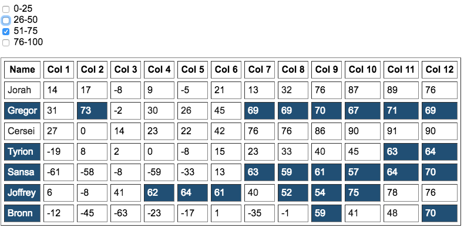
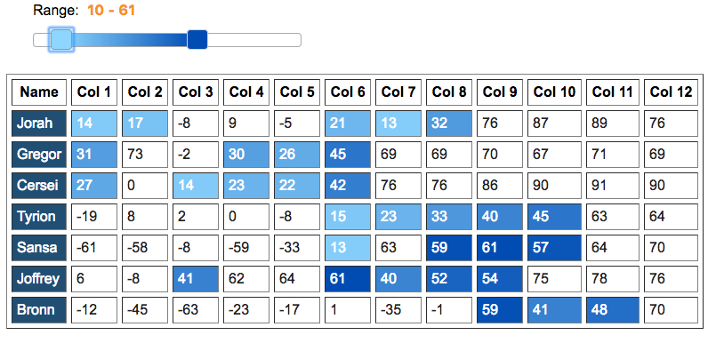

# Tablelight

## Overview

Tablelight highlights cells in a table that are in a certain numerical range, allowing the user to quickly spot relevant data or significant outliers.  There are two versions of Tablelight. 

* <a href="https://codepen.io/wurstrti/pen/bMGLOw" target="_blank">View a demo of Tablelight checkbox</a>
* <a href="https://codepen.io/wurstrti/pen/JvjLWQ" target="_blank">View a demo of Tablelight slider</a>

### Tablelight Checkbox

### Tablelight Slider

## Dependencies

To run tablelight, you will need the following:

* <a href="http://jquery.com/download/" target="_blank">jQuery</a> (minimum version 1.4.1)
* <a href="http://jqueryui.com/download/" target="_blank">jQuery UI</a> (minimum version - 1.7.1) 

## How to use

### Tablelight Checkbox
Tablelight checkbox highlights cells based on ranges selected by checkboxes. The js and css files can be found in the /checkbox directory along with a sample html file.  

  - /checkbox/js/tablelight_checkbox.js is the main JavaScript file  
  - /checkbox/css/tablelight_checkbox.css provides some basic default files  

You needs a `<fieldset id="tl-ranges"></fieldset>` element in your html to hold the range checkboxes.  The range values themselves are held in an object called tlRanges with the keys:

  - tl-neg
  - tl-a
  - tl-b
  - tl-c
  - tl-d

The tl-neg key-value pair is used to express negative values.  

The table holding the data needs a class "tl-table."  Configuration occurs in the variable definitions in the .on handler near the top of the tablelight_checkbox.js file:

* tableclasser - class of the data table.  Default: tl-table
* highlightbg - color value for highlighted cells.  Default: #214f74
* highlightfont - text color for highlighted cells.  Default: #fff
* lowlightbg - color of the non-selected cells.  Default: transparent
* lowlightfont - text color of the non-selected cells. Default: #222

### Tablelight Slider

Tablelight slider highlights cells based on ranges selected by a slider interface. The js and css files can be found in the /slider directory along with a sample html file.  

  - /slider/js/tablelight_slider.js is the main JavaScript file  
  - /slider/css/tablelight.slider.css provides some default files  

Your webpage will need a wrapper div `

` for the slider and a div `

` inside of it.  The default range for the slider is 0 - 100.  If you wish to change the min and max values for the slider, change those parameters in the $( "#tl-slider-range" ).slider( { } ) configuration.

The table holding the data needs a class "tl-table".  Configuration occurs in the variable definitions at the top of the tablelight_slider.js file:

*Gradient colors*  
* colorstarter - minimum value gradient color
* colorender - maximum value gradient color
  * More gradients can be found at [uigradients](https://uigradients.com)  
* tableclasser - class of the data table.  Default: tl-table
* highlightbg - color value for highlighted cells.  Default: #214f74
* highlightfont - text color for highlighted cells.  Default: #ffffff
* lowlightbg - color of the non-selected cells.  Default: transparent
* lowlightfont - text color of the non-selected cells. Default: #222
* animatespeed - speed of the highlighting animation.  Default: 2000
* grad - show gradient or just solid color.  1 for gradient, 0 for solid color
* maxcolor - color for 100% max value color.  Default: colorender

## Authors

The authors of TableLight are Mark Koyanagi, Rebecca Watkins, and Keith Wurst.

## Acknowledgments

We would like to acknowledge David Rice for the assistance and support he provided with this project.

## License

The MIT License (MIT)

Copyright (c) 2018 

Permission is hereby granted, free of charge, to any person obtaining a copy of this software and associated documentation files (the "Software"), to deal in the Software without restriction, including without limitation the rights to use, copy, modify, merge, publish, distribute, sublicense, and/or sell copies of the Software, and to permit persons to whom the Software is furnished to do so, subject to the following conditions:

The above copyright notice and this permission notice shall be included in all copies or substantial portions of the Software.

THE SOFTWARE IS PROVIDED "AS IS", WITHOUT WARRANTY OF ANY KIND, EXPRESS OR IMPLIED, INCLUDING BUT NOT LIMITED TO THE WARRANTIES OF MERCHANTABILITY, FITNESS FOR A PARTICULAR PURPOSE AND NONINFRINGEMENT. IN NO EVENT SHALL THE AUTHORS OR COPYRIGHT HOLDERS BE LIABLE FOR ANY CLAIM, DAMAGES OR OTHER LIABILITY, WHETHER IN AN ACTION OF CONTRACT, TORT OR OTHERWISE, ARISING FROM, OUT OF OR IN CONNECTION WITH THE SOFTWARE OR THE USE OR OTHER DEALINGS IN THE SOFTWARE.